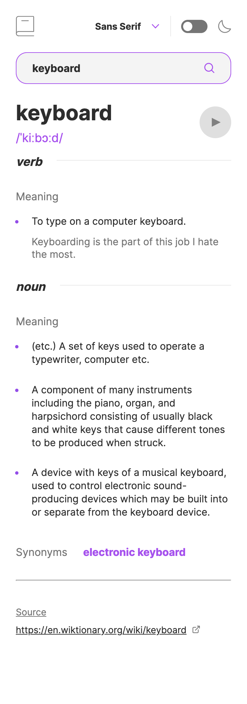

# Frontend Mentor - Dictionary web app solution

This is a solution to the [Dictionary web app challenge on Frontend Mentor](https://www.frontendmentor.io/challenges/dictionary-web-app-h5wwnyuKFL). Frontend Mentor challenges help you improve your coding skills by building realistic projects. 

## Table of contents

- [Overview](#overview)
  - [The challenge](#the-challenge)
  - [Screenshot](#screenshot)
  - [Links](#links)
- [My process](#my-process)
  - [Built with](#built-with)
  - [What I learned](#what-i-learned)
  - [Continued development](#continued-development)
  - [Useful resources](#useful-resources)
- [Author](#author)


## Overview

### The challenge

Users should be able to:

- Search for words using the input field
- See the Free Dictionary API's response for the searched word
- See a form validation message when trying to submit a blank form
- Play the audio file for a word when it's available
- Switch between serif, sans serif, and monospace fonts
- Switch between light and dark themes
- View the optimal layout for the interface depending on their device's screen size
- See hover and focus states for all interactive elements on the page
- **Bonus**: Have the correct color scheme chosen for them based on their computer preferences. _Hint_: Research `prefers-color-scheme` in CSS.

### Screenshot




### Links

- Solution URL: [Solution](https://github.com/andyjv1/Dictionary-web-app.git)
- Live Site URL: [Live](https://majestic-marigold-08b93d.netlify.app/)

## My process

### Built with

- Semantic HTML5 markup
- CSS 
- Flexbox
- Mobile-first workflow
- React
- Dictionaryapi

### What I learned

I have learned a lot form this project. I learn how to use the following things for  this project: Route, Routes, BrowserRouter, Outlet, useParams, useOutletContext, Object.values, Object.keys and forEach. 


```js
    <BrowserRouter>
      <Routes>
        <Route path="/*" element={<App />} />
      </Routes>
    </BrowserRouter>

    <Routes>
      <Route path="/" element={<Layout />}>
        <Route path=":id" element={<Body />} />
      </Route>
    </Routes >

    Object.keys(definition).forEach(function (key) {...})

    Object.values(wordsSynonyms)[index].map((y, index) => {
      return <span>{(index ? ', ' : '') + y}</span>
    })
```

### Continued development

I want to continue focusing on semantic HTML tags and CSS methodologies in future projects. I also wand to learn redux in my next project .

### Useful resources

- [BrowserRouter](https://www.javatpoint.com/browserrouter-in-react)
- [Outlet](https://reactrouter.com/en/main/components/outlet) 
- [useParams](https://medium.com/geekculture/how-to-use-react-router-useparams-436851fd5ef6) 
- [useOutletContext](https://reactrouter.com/en/main/hooks/use-outlet-context) 
- [Object.values()](https://developer.mozilla.org/en-US/docs/Web/JavaScript/Reference/Global_objects/Object/values) -


## Author

- Frontend Mentor - [@andyjv1](https://www.frontendmentor.io/profile/andyjv1)
